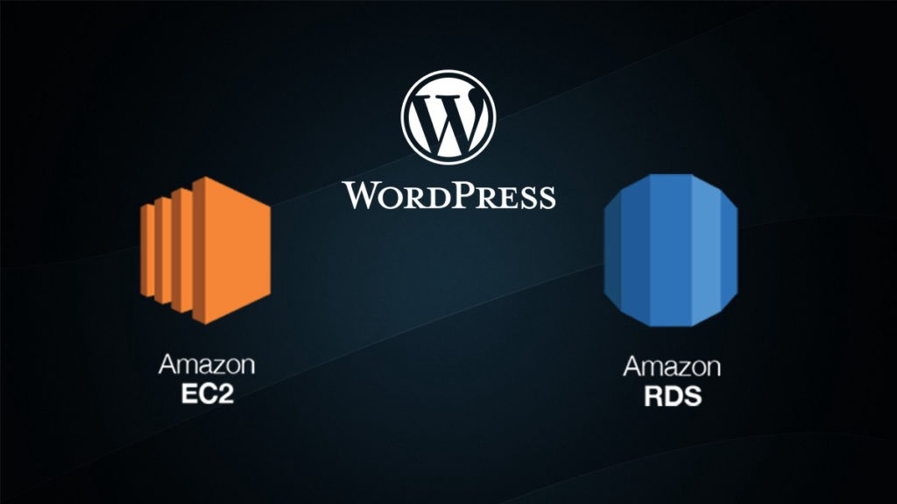

# WordPress with RDS



Criar um ambiente para servir o WordPress.

## Ferramentas utilizadas

* **Amazon Web Services**
  * [Website](https://aws.amazon.com/free/free-tier/)
  * [Docs](https://docs.aws.amazon.com/)

* **Terraform**
  * [Website](https://www.terraform.io/)
  * [Docs](https://www.terraform.io/docs/index.html)

* **Ansible**
  * [Website](https://www.ansible.com/)
  * [Docs](https://docs.ansible.com/)

* **Docker**
  * [Website](https://www.docker.com/)
  * [Docs](https://docs.docker.com/)

# Como fazer o deploy

## Gerar um par de chaves

```
ssh-keygen -P "" -t rsa -b 2048 -f ~/aws_key
```

## Terraform

Editar `variables.tf`

```
default = "../../keys/aws_key.pub"
```

Criar instância EC2 na AWS

Inicializar Terraform

```bash
terraform init
```

Criar o plano

```bash
terraform plan
```

Aplicar as mudanças

```bash
terraform apply
```

Outputs gerados

```
db_instance_endpoint = "mysql-instance.123456789012.us-east-1.rds.amazonaws.com:3306"
instance_public_ip = "3.16.70.78"
```

## Registrar Zona DNS

Configurar o domínio ou subdomínio e o IP

| Nome | TTL | Classe | Tipo | Registro
| --- | --- | --- | --- | --- |
| wp.example.com | 3600 | IN | A | 3.16.70.78

## Ansible

Editar `ansible.cfg`

```
private_key_file=./keys/aws_key
```

Editar `main.yml` dentro do `inventory`

```
all:
  vars:
    domain_name: wp.example.com
    certbot_email: example@email.com
  hosts:
    3.16.70.78:
```

Editar `docker-compose.yml` dentro do `wordpress`

```
environment:
  WORDPRESS_DB_HOST: mysql-instance.123456789012.us-east-1.rds.amazonaws.com
  WORDPRESS_DB_USER: admin
  WORDPRESS_DB_PASSWORD: 12qwaszx
  WORDPRESS_DB_NAME: wpdb
```

Executar o playbook

```
ansible-playbook wordpress-with-rds.yml
```

## Licença

Esse projeto está sob licença. Veja o arquivo [LICENÇA](LICENSE.md) para mais detalhes.

[Voltar ao topo](#wordpress-with-rds)<br>
